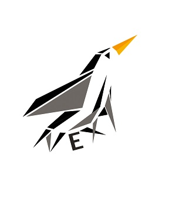

# Intel Next Kernel
Intel Next consolidates development efforts across the SSP and collaborating business units by providing an early integration Linux kernel and Linux-based System Validation Images. Intel Next source code is classified as Intel Confidential. Do not distrubute the source code externally.
## Contributions
Intel Next development happens on our mailing list: https://eclists.intel.com/sympa/info/intel-next
## Binary Releases
rpm/deb binaires for the latest kernel are published most business days to Github. Release notes are sent to our announce mailing list: https://eclists.intel.com/sympa/info/intel-next-announce
## Support
Please email intel-next-maintainers@eclists.intel.com for questions or support.
## More Infomation
Visit our Intelpedia page for more documentation: https://intelpedia.intel.com/IntelNext

## Fast Manifest Reference

| Topic Branch                 | Description                                                                                                                                                    | Targeted platforms              | Contributor                | Email                                      | Repo URL                                                                                                      | Branch                            | Reference                                |
|------------------------------|----------------------------------------------------------------------------------------------------------------------------------------------------------------|---------------------------------|----------------------------|--------------------------------------------|---------------------------------------------------------------------------------------------------------------|-----------------------------------|------------------------------------------|
| eywa                         | intel-next scripts and patches                                                                                                                                 | N/A                             | Intel Next Maintainers     | intel-next-maintainers@eclists.intel.com   | https://github.com/intel-innersource/os.linux.intelnext.kernel.git                                            | eywa                              | 75c9a6c1201688127315edb8604c91b0c03b9bbb |
| configs                      | intel-next scripts and patches                                                                                                                                 | N/A                             | Intel Next Maintainers     | intel-next-maintainers@eclists.intel.com   | https://github.com/intel-innersource/os.linux.intelnext.kernel.git                                            | configs                           | 68fd50a0704cfddaf1737853272e03889d2bc0c5 |
| packaging                    | intel-next scripts and patches                                                                                                                                 | N/A                             | Intel Next Maintainers     | intel-next-maintainers@eclists.intel.com   | https://github.com/intel-innersource/os.linux.intelnext.kernel.git                                            | packaging                         | a5b375a2a61c0172782a45d5502247eb71315298 |
| SVOS Kernel                  | SVOS Kernel/Driver Changes                                                                                                                                     | N/A                             | Adam Preble                | adam.c.preble@intel.com                    | https://github.com/intel-innersource/os.linux.validation.svos-next.svos-next                                  | svos-next-pull-6.6                | e00ea68df73348b2cf067572a2b5426127c24782 |
| branding                     | Custom intel-next logo on bootup                                                                                                                               | N/A                             | Kyle Pelton                | kyle.d.pelton@intel.com                    | https://github.com/intel-sandbox/otc_power_kernel                                                             | intel_next_branding               | 2c8737a3e419ce4e8d2fc81547e0ed8c75991af9 |
| pm-testing                   | Linux Next PM public tree                                                                                                                                      | N/A                             | Rafael Wysocki             | rafael.j.wysocki@intel.com                 | https://git.kernel.org/pub/scm/linux/kernel/git/rafael/linux-pm.git                                           | testing                           | 25839bdc2530446faa0704f1bc6119ba6f161415 |
| tpm                          | Linux Next TPM public next tree                                                                                                                                | N/A                             | Jarkko Sakkinen            | jarkko.sakkinen@intel.com                  | https://git.kernel.org/pub/scm/linux/kernel/git/jarkko/linux-tpmdd.git                                        | next                              | 03acb9ccec3f8cbcc0ed93c188b7a119ef30ef64 |
| drm                          | Drm embargo branch                                                                                                                                             | N/A                             | Ashutosh Dixit             | ashutosh.dixit@intel.com                   | https://github.com/intel-innersource/drivers.gpu.i915.drm-intel.git                                           | for-intel-next                    | 5b80791b3b3caf7f5c38edf4e9645507cfbea755 |
| mmc                          | MMC Subsystem and SCS (eMMC/ SD card / SDIO / UFS) driver enabling                                                                                             | LNL                             | Adrian Hunter              | adrian.hunter@intel.com                    | https://github.com/intel-sandbox/ahunter6.next.git                                                            | scs-v6.6                          | a2db273729e4ce3d6443b95ef9b1693314583942 |
| mei                          | CSE/CSME MEI driver and MEI client drivers                                                                                                                     | LNL,MTL,PNL                     | Alexander Usyskin          | alexander.usyskin@intel.com                | https://github.com/intel-innersource/drivers.security.cse.drivers.linux-mei-pk.git                            | cse-6.6                           | 3051008f8ffde839d188fabd9e4bfc608cac3007 |
| lpss_gpio                    | LPSS(MFD/DMA/UART)/GPIO enabling for LNL,MTL(SoC P, S and PCH S variants),ADL,TGL,ICL and other/older platforms                                                | ADL,ICL,LNL,MTL,TGL             | Andy Shevchenko            | andriy.shevchenko@linux.intel.com          | https://github.com/intel-sandbox/ashevche.linux.kernel                                                        | intel/for-next                    | 0d7cb9784bf05af8fee86964d5cc40caeed39d6a |
| edac                         | EDAC for SPR and IEH for TGL                                                                                                                                   | SPR,TGL                         | Qiuxu Zhou                 | qiuxu.zhuo@intel.com                       | https://github.com/intel-sandbox/qzhuo-linux.git                                                              | edac-for-intel-next               | a989ed2c3cb0c72939c07cb47a740ab6e5816347 |
| pmc_core                     | PMC core driver                                                                                                                                                | LNL,MTL,SKL,TGL                 | Xi Pardee                  | xi.pardee@intel.com                        | https://github.com/intel-sandbox/xi_linux.git                                                                 | pmc_core_intel_next               | 3700d4b8abf4eab0163309ff25b623e2a12b5699 |
| tracehub                     | Contains tracehub support for Granite Rapids, Meteor Lake, Raptor Lake.                                                                                        | GNR,MTL,RPL                     | Alexander Shishkin         | alexander.shishkin@linux.intel.com         | https://github.com/intel-sandbox/linux-stm.git                                                                | intel_th-for-intel-next           | 5495650f9a4b2efe31fab7051e33a826d579d1c5 |
| usb-typec                    | USB Type-C/DWC3 for MTL-S                                                                                                                                      | MTL-S                           | Heikki Krogerus            | heikki.krogerus@linux.intel.com            | https://github.com/intel-sandbox/hkrogeru-linux.git                                                           | for-eywa                          | 3550e9ed240fc6b15975a50d6b9570faf5e8b139 |
| rapl/idle                    | intel_rapl/intel_idle/thermal/turbostat support                                                                                                                | ADL,EMR,GNR,MTL,RPL             | Rui Zhang                  | rui.zhang@intel.com                        | https://github.com/intel-sandbox/rzhang1.git                                                                  | for-intel-next                    | 3620fcde32cb419694e3121d213990922bed1a00 |
| perf-tools                   | Updates to perf tools for Intel PT                                                                                                                             | N/A                             | Adrian Hunter              | adrian.hunter@intel.com                    | https://github.com/intel-sandbox/ahunter6.next.git                                                            | intel-pt-perf-tools-v6.6          | 73df50c65ffca69eb1a96d3f01772dfed1382cb6 |
| hybrid                       | Enable Intel Thread Director (ITD) as well as code to discover and enumerate the topology of hybrid CPUs.                                                      | ADL,ARL,LKF,LNL,MTL,RPL         | Ricardo Neri               | ricardo.neri-calderon@linux.intel.com      | https://github.com/intel-sandbox/ranerica.linux.git                                                           | rneri/hybrid-for-intel-next       | 1f3779e9022027fd3db744fa7c481e7ca69e968f |
| LASS                         | Enable LASS                                                                                                                                                    | N/A                             | Alexander Shishkin         | alexander.shishkin@intel.com               | https://github.com/intel-sandbox/linux-perf.git                                                               | lass                              | 805a56cb7a7d689dbea2d7305d526be17acae270 |
| dlb2                         | The dlb2 driver is a kernel module that supports configuration and use of the DLB 2.0 device                                                                   | N/A                             | Mike Ximing Chen           | mike.ximing.chen@intel.com                 | https://github.com/intel-innersource/drivers.scheduling.dynamic-load-balancer.upstreamed-dlb-linux-driver.git | dlb2-for-intel-next-v6.6-rc5      | 54d08ed33b5df16d13f4cceefd6082886c4fae2c |
| SPI-NOR/PCI/Thunderbolt/USB4 | SPI-NOR/PCI/Thunderbolt/USB4 enabling for LNL-M, Barlow Ridge                                                                                                  | LNL-M                           | Mika Westerberg            | mika.westerberg@linux.intel.com            | https://github.com/intel-sandbox/mwesterb-linux.git                                                           | for-eywa                          | 7136d48146937cc26c4dd176355d2f50257fd348 |
| prm_linux_support            | PRM runtime update support for Intel PRM-capable platforms                                                                                                     | EMR,GNR                         | Aubrey Li                  | aubrey.li@intel.com                        | https://github.com/intel-sandbox/aubrey-linux.git                                                             | prm_v6.6_for_intel_next           | 36f0dc0bec7a5d74ec3779916026722769ad4840 |
| In Field Scan                | Enable In Field Scan device driver                                                                                                                             | N/A                             | Jithu Joseph               | jithu.joseph@intel.com                     | https://github.com/intel-sandbox/drivers.saf.git                                                              | v6.6-rc3-ucode-ifs-for-nxt        | c450663966d9e788d906af59657f6e942dac4329 |
| cxl                          | CXL Memory Expander support                                                                                                                                    | N/A                             | Dan J Williams             | dan.j.williams@intel.com                   | https://git.kernel.org/pub/scm/linux/kernel/git/cxl/cxl                                                       | next                              | 5d09c63f11f083707b60c8ea0bb420651c47740f |
| LPSS/SMBus                   | Add I2C support for MTl, Birchstream                                                                                                                           | GNR,MTL                         | Jarkko Nikula              | jarkko.nikula@linux.intel.com              | https://github.com/intel-sandbox/jarkkoni.linux.kernel.git                                                    | for-intel-next                    | 50d4ec3eafb7d9dbb39dc7a65884d708383fc420 |
| sep_socwatch                 | SoCWatch and SEP drivers                                                                                                                                       | N/A                             | Swedhana Viswanathan       | swedhana.viswanathan@intel.com             | https://github.com/intel-sandbox/sep-socwatch.linux.intelnext.kernel.git                                      | sep_socwatch_linux_v6.6           | 4a8a476502a42de9e1acc04b40e4cfb7592cbf1e |
| MTLDIDs                      | Add DIDs 8086:7D0B and 8086:AD0B for Intel MTL-M/S SKU's                                                                                                       | MTL-M                           | Francisco Munoz Ruiz       | francisco.munoz.ruiz@intel.com             | https://github.com/intel-sandbox/otc_power_kernel                                                             | mtl_dids_linus_rc                 | c600f9c2babba00df0c0fba95c35c8da353f9989 |
| tdx_guest                    | TDX Guest support                                                                                                                                              | EMR,GNR,SPR,SRF                 | Sathyanarayanan Kuppuswamy | sathyanarayanan.kuppuswamy@linux.intel.com | https://github.com/intel/tdx.git                                                                              | guest-next                        | 9b0a9612ce55c4a30160f661ae80ea8042f987bf |
| lam_lass_kvm                 | Linear Address Masking KVM Enabling                                                                                                                            | GRR,LNL,SRF                     | Binbin Wu                  | binbin.wu@intel.com                        | https://github.com/binbinwu1/linux                                                                            | lam_lass_combined                 | 4e96fe29c695b9edfc3c411ad06bda0c07599e39 |
| tracepoint_xsave             | Measure the latency of XSAVE and XRSTOR                                                                                                                        | EMR,GNR,SPR                     | Yi Sun                     | yi.sun@linux.intel.com                     | https://github.com/intel-sandbox/linux-sy.git                                                                 | tracepoint-xsave-for-inext-v6.6   | b2c2a765e9932905dd5d801efc843dab391b5a53 |
| tdx_compliance               | TDX compliance is designed to verify TDX environment.                                                                                                          | EMR,GNR,SPR                     | Yi Sun                     | yi.sun@linux.intel.com                     | https://github.com/intel-sandbox/linux-sy.git                                                                 | tdx-compliance-for-inext-v6.6     | 8c8fc0c3e6aa3d1527e9ee3c26a9242c0cf393e5 |
| lnlm_telemetry               | LNL-M telemetry and watcher support                                                                                                                            | LNL                             | Rajvi Jingar               | rajvi.jingar@intel.com                     | https://github.com/intel-sandbox/linux-kernel-rjingar.git                                                     | for-intel-next                    | ee6e59cbf44ad2d0a6fa5185dfdab81159b23c0f |
| guest_apic_virt              | Guest apic virt timer patches for CWF                                                                                                                          | CWF                             | Yang Zhong                 | yang.zhong@linux.intel.com                 | https://github.com/intel-sandbox/yangzhon-linux.git                                                           | for-intel-next                    | 609b17edf1a08148baa9c8cec6cb1eabde0ea2b3 |
| cpuid_cwf_dmr_nis            | Advertise CPUID of CWF/DMR instructions to userspace                                                                                                           | CWF,DMR                         | Tao Su                     | tao1.su@intel.com                          | https://github.com/intel-sandbox/taosu.linux.git                                                              | cwf-dmr-nis-6.6                   | aff24d33e8a78c9f05742d82596440d5637af9ed |
| utimer_next                  | Enable User Timer support                                                                                                                                      | N/A                             | Sohil Mehta                | sohil.mehta@intel.com                      | https://github.com/intel-sandbox/sohilmeh.linux.git                                                           | utimer-next                       | c1fa984f761c82a50de59773b9f6d48afbaff910 |
| thread_director_virt         | Enable Intel Thread Director (ITD) in virtualization scenario                                                                                                  | ADL,LNL,MTL,RPL                 | Zhao Liu                   | zhao1.liu@intel.com                        | https://github.com/intel-sandbox/zhaoliu.linux.git                                                            | hybrid-virtual-for-intel-next     | 06e45b993d27a681b5a99f5e53cc7f16db7a69e9 |
| fred_support                 | Intel FRED support                                                                                                                                             | N/A                             | Xin Li                     | xin3.li@intel.com                          | https://github.com/intel-sandbox/linux-fred.git                                                               | intel-next-fred-v6.6-rc1          | 202b061701b77f25c9f4209fedb3d01e8998f677 |
| disable_cet_before_shutdown  | Disable CET before shutdown                                                                                                                                    | N/A                             | Mateusz Mowka              | mateusz.mowka@intel.com                    | https://github.com/mateusz-mowka/tboot_linux.git                                                              | tboot_disable_cet_before_shutdown | a76b9863bc5ec131aefd9b314e3e04861600e2b4 |
| siov                         | Internal SIOV kernel development tree                                                                                                                          | N/A                             | Yi Sun                     | yi.y.sun@linux.intel.com                   | https://github.com/intel-sandbox/yisun1-siov.git                                                              | 6.6-rc2_siov                      | 33660de216fdce1c44233cc932f5021c2d44dd7b |
| kvm_2_0                      | KVM TDX v1.5                                                                                                                                                   | N/A                             | Chenyi Qiang               | chenyi.qiang@intel.com                     | https://github.com/intel-sandbox/cqiang-tdx-kvm.git                                                           | for-intel-next-2.0                | 357d0cdec16a1a3d8da7d61067bf1fcc3eef2993 |
| dynamic_lockstep             | Dynamic lockstep support                                                                                                                                       | N/A                             | Sohil Mehta                | sohil.mehta@intel.com                      | https://github.com/intel-sandbox/sohilmeh.linux.git                                                           | dlsm-next                         | fb035a6c67b7457547ce701ff4e1d447eca99ff0 |
| kvm_1_0_fixup                |                                                                                                                                                                | N/A                             | Michael Bottini            | michael.a.bottini@intel.com                | https://github.com/intel-sandbox/otc_power_kernel.git                                                         | kvm_1_0_fixup                     | a6cd91ba3835b31cdf454227889f73b1954a9f38 |
| kvm_cet                      | KVM: Arch LBR and CET features                                                                                                                                 | EMR,GNR,SPR                     | Weijiang Yang              | weijiang.yang@intel.com                    | https://github.com/intel-sandbox/weijiang.linux.kvm.git                                                       | v6.6-rc2-kvm-cet-rebase           | 7e8bfbee1dd9c371371c1a68d9a8692ea4e4c55d |
| pcie_bwctrl                  | This pull request enables PCIe Bandwidth Controller (bwctrl) and associated PCIe cooling devices on thermal subsystem side                                     | N/A                             | Ilpo Järvinen              | ilpo.jarvinen@linux.intel.com              | https://github.com/intel-sandbox/ijarvine.linux.kernel                                                        | intel-next/bwctrl-v6.6-rc         | 335d83208472a713d72c8fb917681e46f7809ed4 |
| swq_vfio_idxd_vdev           | SIOV/VFIO/PASID/IDXD enabling                                                                                                                                  | N/A                             | Fenghua Yu                 | fenghua.yu@intel.com                       | https://github.com/intel-sandbox/idxd                                                                         | fyu/idxd.vdev.6.6.swq             | b91c6f7e0e5c279cababf581a06a3023db01342a |
| sgx_enclave_shadow_stacks    | Enable Shadow Stacks for SGX Enclaves                                                                                                                          | GNR,SRF                         | Haitao Huang               | haitao.huang@linux.intel.com               | https://github.com/haitaohuang/linux.git                                                                      | for-next                          | 900ad9d7e23182b22feb04e77ccef6ddb7e01a16 |
| swq_vfio_idxd_vdev_fixup     | Fixup for stub function vfio_ims_msi_virq                                                                                                                      | N/A                             | Michael Bottini            | michael.a.bottini@intel.com                | https://github.com/intel-sandbox/otc_power_kernel.git                                                         | swq_vfio_idxd_vdev_fixup          | c0d364386f04beb3d766f7c5305bcf53289232ee |
| cxl_driver_fixes_gnr         |                                                                                                                                                                | GNR                             | Alison Schofield           | alison.schofield@intel.com                 | https://github.com/intel-sandbox/cxl.git                                                                      | as/cxl-for-inext                  | 962fdd6dcb969101ceef7371da620efb6cdaaab0 |
| dsa2_pasid                   | DSA2.0 inter-domain pasid                                                                                                                                      | N/A                             | Fenghua Yu                 | fenghua.yu@intel.com                       | https://github.com/intel-sandbox/idxd                                                                         | fyu/dsa2.idp.6.6                  | 0f0477315a826a2fd18663f65a550c5293d49306 |
| iommu_hotfix                 | Fixes a kernel initialization hang with the kernel boot parameter 'iommu=pt.'                                                                                  | N/A                             | Adam Preble                | adam.c.preble@intel.com                    | https://github.com/intel-innersource/os.linux.validation.svos-next.svos-next.git                              | iommu-devtlb-fix-6.6              | a53fec56d4ddcd5c0bbcdbd6aec70f32658bb02d |
| tdx_mca                      | TDX non-root machine check recovery                                                                                                                            | N/A                             | Tony Luck                  | tony.luck@intel.com                        | https://github.com/intel-sandbox/agluck-linux.git                                                             | tdx_mca                           | 5d4f1f30a5eeb1b1aad158d451fa704ba17a683c |
| perf                         | This pull request introduces the Linux perf PMU support for PMU core and uncore support. It also has fixes for the SPR uncore support, IOMMU PerfMon and MSRL. | ARL,EMR,GNR,GRR,LNL,MTL,SPR,SRF | Zhenyu Wang                | zhenyuw@linux.intel.com                    | https://github.com/intel-innersource/os.linux.perf.intel-next.git                                             | perf-intel-next                   | 1cd87c857361f8b45cd6105050ef02478aee38c6 |
| kvm_msr_support              | This pull request is for enabling KVM User MSR support.                                                                                                        | N/A                             | Yunhong Jiang              | yunhong.jiang@intel.com                    | https://github.com/intel-sandbox/linux-royalkvm.git                                                           | umsr-next                         | 008aa29cac8208a47c9379f56083cf874cd21631 |
| svos_tdx                     | SVOS TDX Modifications for v6.5                                                                                                                                | N/A                             | Rodolfo Gomez Zurita       | rodolfo.gomez.zurita@intel.com             | https://github.com/intel-innersource/os.linux.validation.svos-next.svos-next.git                              | svos-next-tdx-pull-6.6            | f93a8c5956a04d0259d904056ae516a207d18a9a |
